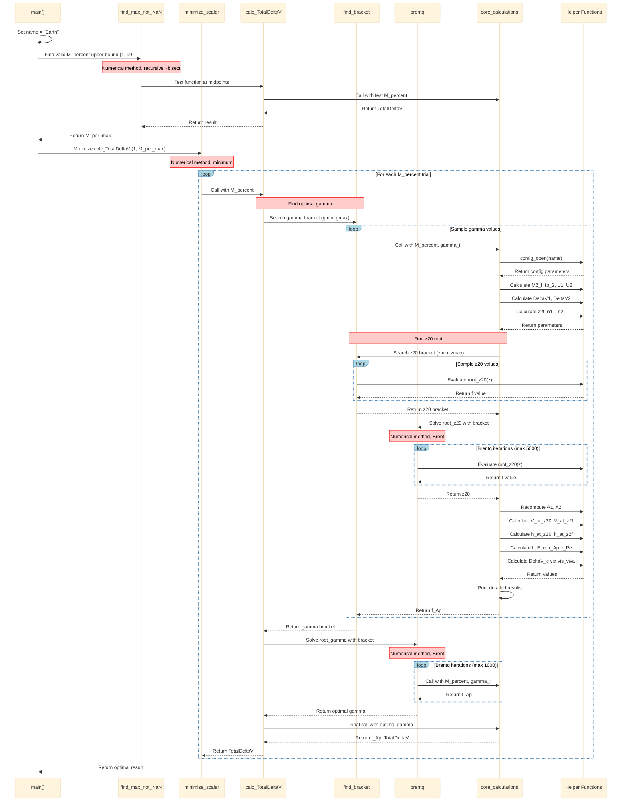

# Trajectory calculation, python

## Introduction

There are three files uploaded, "DeltaV_calculations.py" is the program, the .yaml file is the config file, and the test.py variant is jusst a test program for the "find_max_not_NaN" fuction.

If you are looking for the results look into the "Results" folder.

## Diagrams

### Algorithms, sequence

This is a more robust and complicated description of the calculations.

